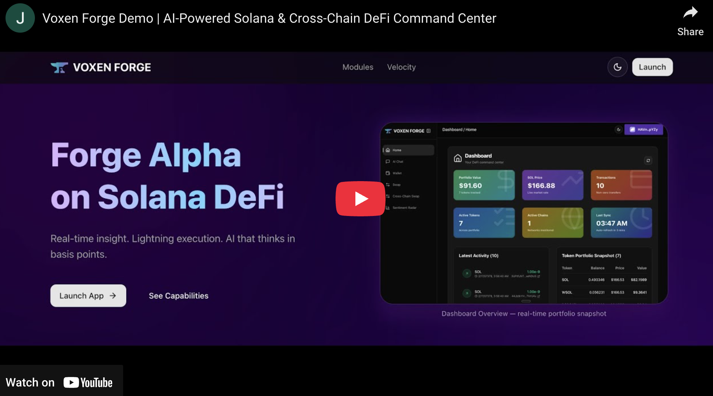
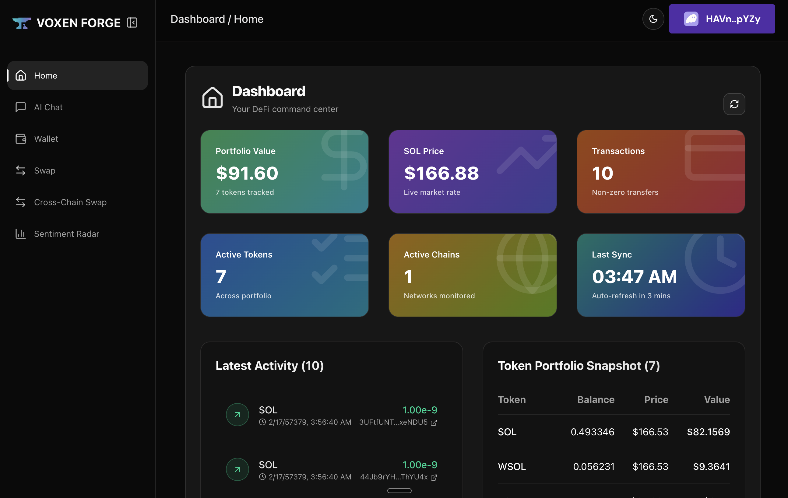
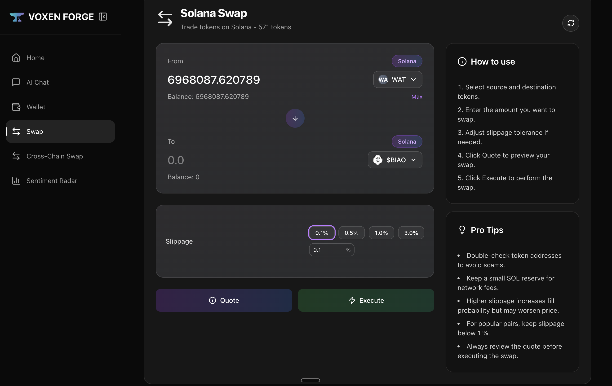
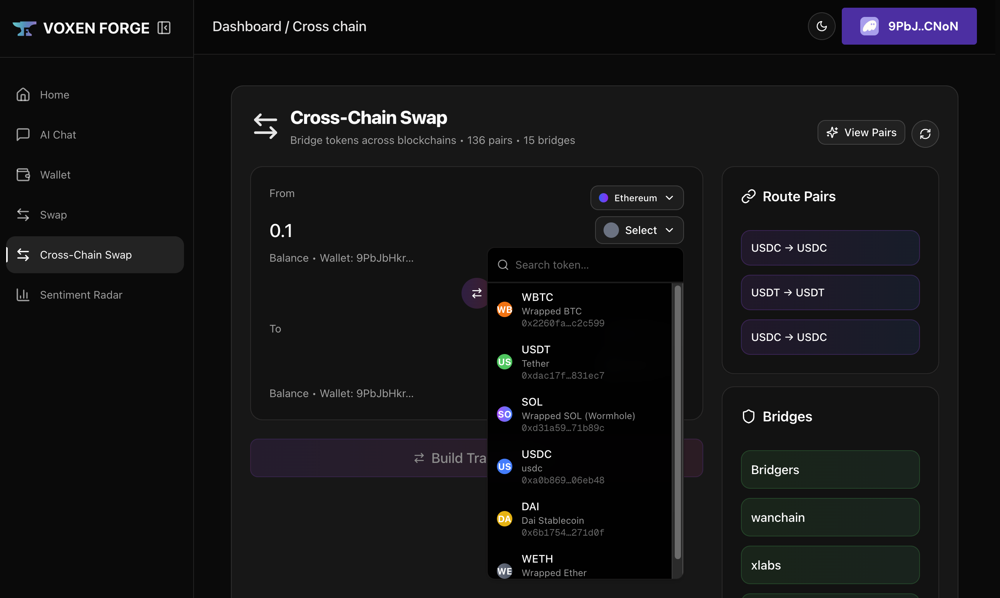
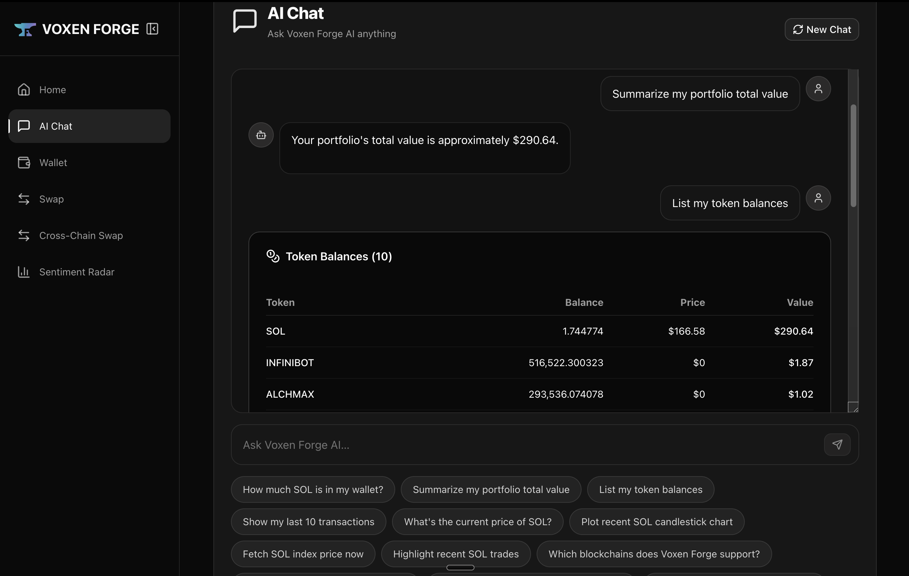
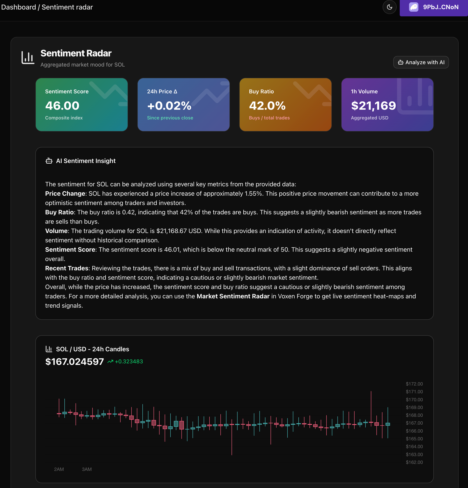

# Voxen Forge ⚒️

**All-in-one Solana-first DeFi cockpit with AI analytics, cross-chain routing and gas-optimised trades.**

[](https://youtu.be/AorTZiHTodA)

## Why Voxen Forge?

Voxen Forge bundles everything a power user needs into one lightweight Next.js app:

- 📈 **Live Portfolio Dashboard** – balances, P&L and market stats refresh every few seconds.
- 💬 **AI Copilot** – natural-language chat that pulls fresh on-chain data, price charts and trade history.
- 🔄 **Solana Swap** – instant SOL-native swaps with slippage control and one-click execution.
- 🌉 **Cross-Chain Swap** – bridge + swap across 20+ chains via OKX liquidity in a single transaction.
- 🛰️ **Sentiment Radar** – AI summarises social, price and volume signals into one "mood" score.

---

## Quick tour 🚀

| Screenshot                                         | Module                                            |
| -------------------------------------------------- | ------------------------------------------------- |
|  | **Overview** – real-time assets, charts and stats |
|                     | **Solana Swap** – pick tokens, quote, execute     |
|  | **Bridge & Swap** – move value between chains     |
|               | **AI Chat** – ask questions, get charts & tables  |
|       | **Sentiment Radar** – market mood at a glance     |

---

## Feature highlights 🌟

- **Zero-friction wallet** – Phantom, Solflare and Ledger auto-connect.
- **OKX DEX API** – deep liquidity, signed requests and automatic rate-limit handling.
- **Blazing UI** – Tailwind CSS with glassmorphism and motion.
- **Smart caching** – per-route in-memory fetch cache keeps the UI snappy while preserving accuracy.
- **Retry-safe queuing** – every upstream call passes through a single serial queue with exponential back-off.
- **Code-split hooks** – each page imports only the data hooks it needs, trimming bundle size.

---

## Getting started 🛠️

```bash
pnpm install
pnpm dev
```

Create `.env` by copying `.env.example` and inserting your **OKX DEX API** keys plus an **OPENAI_API_KEY** for the AI copilot.

---

## Project layout 🗂️

```text
app/          Next.js (app router) pages & API routes
components/   Reusable UI and dashboard widgets
lib/          Network clients, hooks, utilities, schemas
public/       Static assets (screenshots, icons)
types/        Shared TypeScript definitions
```

---

## Contributing 🤝

PRs are welcome! Please open an issue first if you plan a large change so we can align on direction.

## Final Output

| Item                | Location                                  |
| ------------------- | ----------------------------------------- |
| Live Demo           | https://voxen-forge.vercel.app            |
| Demo Video          | https://voxen-forge.vercel.app/demo-video |
| Demo Video (Mirror) | https://youtu.be/AorTZiHTodA              |
